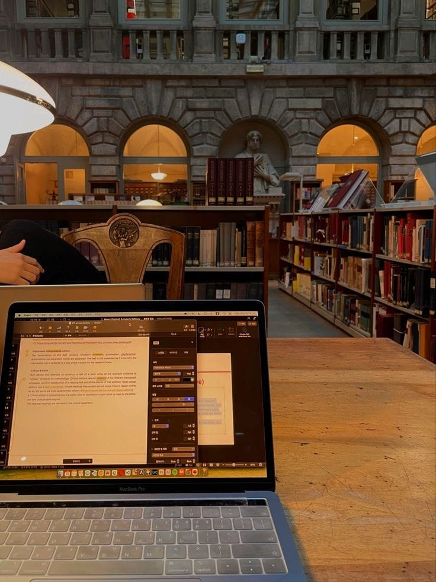

.. project2 documentation master file, created by
   sphinx-quickstart on Thu Dec  5 22:47:41 2024.
   You can adapt this file completely to your liking, but it should at least
   contain the root `toctree` directive.

Stu(dying)
==========

**SUPERVISER:** Mr.MASROUR

**CREATORS:** AOUSSAR Wissal & EL RHAZI Kaoutar

This project leverages Streamlit to develop an interactive platform where users can upload PDF documents.

The system processes the PDF to automatically generate flashcards, aiding in the extraction and memorization of key information.

Additionally, a chatbot is integrated to provide on-demand, context-driven responses based on the content of the uploaded PDF, facilitating efficient information retrieval and enhancing the user learning experience. 😁

Building the chatbot
====================

We used Ollama models and embedding to create a Streamlit app capable of answering questions on the uploaded PDF document.

The models used
===============

**llama3.2:**
----------------------
- Llama 3.2 is a language model introduced by Meta in 2024, featuring a variety of model sizes to suit different needs.

**mxbai-embed-large:**
---------------------------
- It was trained with no overlap of the MTEB data, indicating that the model generalizes well across several domains, tasks, and text lengths when embedding your dataset.

**PDF to Q&A Converter**
===============

This project is a Streamlit-based application that processes PDF documents to generate question-and-answer pairs based on the content. It uses PyMuPDF and pdfplumber for text and metadata extraction, and leverages NVIDIA's NeMo Inference API for generating Q&A responses.

**Features:**

-Extracts metadata and text from uploaded PDFs.
-Splits text into manageable chunks for processing.
-Generates 5 relevant questions and answers from each text chunk using the NVIDIA NeMo API.
-Outputs the Q&A pairs as a downloadable text file.

**Installation:**

   *--Prerequisites:*
1. Python 3.8 or higher.
2. NVIDIA NeMo account with an API key and endpoint.
3. NVIDIA-compatible environment for accessing the NeMo model via the OpenAI client.

   *--Steps:*

1. Clone the repository:

``git clone <repository-url>
cd <repository-folder>``

2. Install dependencies:

``pip install -r requirements.txt``

3. Replace placeholders for the API key and endpoint in the code:

``API_KEY = '<your API key>'
ENDPOINT = '<your inference endpoint>'``

4. Run the Streamlit app:

``streamlit run app.py``

**Usage**

1. Open the Streamlit app in your browser (usually at http://localhost:8501).
2. Upload a PDF file.
3. Wait for the app to process the PDF and generate Q&A pairs.
4. Download the generated Q&A file as a .txt file.

**How It Works**

1. PDF Processing:

  -PyMuPDF extracts metadata and text from the PDF.
  -pdfplumber extracts detailed text content.

2. Text Chunking:

  -The text is split into chunks (max 300 words) for processing.

3. Q&A Generation:

  -Each chunk is sent to the NVIDIA NeMo API to generate relevant Q&A pairs.

4. Output:

  -Extracted Q&A pairs are processed and formatted into a downloadable text file.

**Example Output**

``Question: What is the purpose of the Streamlit app?
Answer: The app processes PDF files to extract Q&A pairs.``

``Question: How are the PDFs processed?
Answer: PDFs are processed using PyMuPDF and pdfplumber for text and metadata extraction.``

.. toctree::
   :maxdepth: 2
   :caption: Contents:

